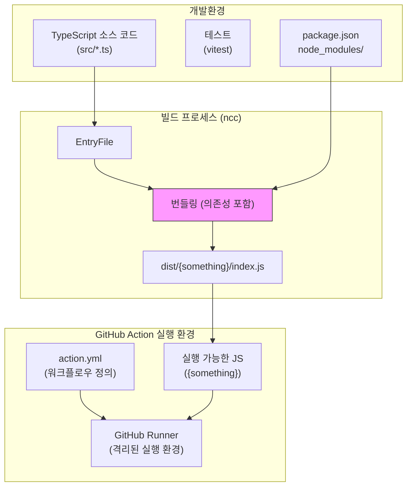
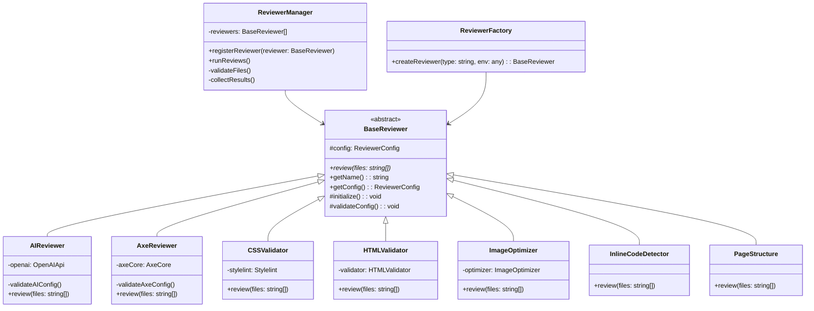
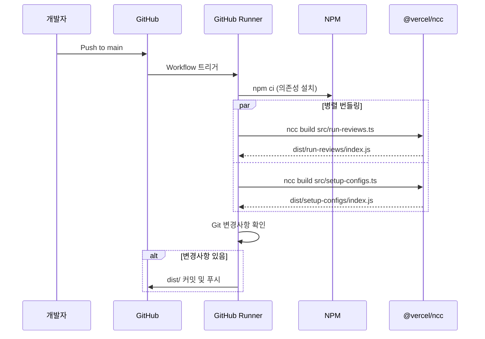
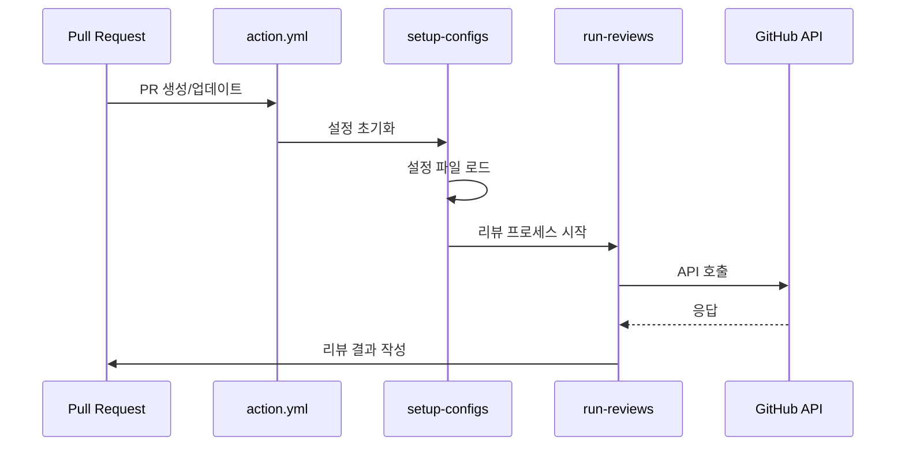

# GitHub Custom Reviewers 아키텍처

## 1. GitHub Action 특성과 빌드 요구사항

GitHub Action은 다음과 같은 특별한 요구사항이 있습니다:
- Action이 실행될 때는 `node_modules`가 없는 환경에서 실행됨
- TypeScript 파일을 직접 실행할 수 없음
- 모든 의존성이 단일 파일로 번들링되어야 함
- 실행 환경이 격리되어 있어 외부 의존성 설치가 제한됨

### 1.1 빌드 프로세스의 필요성
GitHub Action은 격리된 환경에서 실행되므로, 다음 요구사항을 만족해야 합니다:
1. TypeScript -> JavaScript 변환
2. 모든 의존성을 포함한 단일 파일 번들링
3. 실행 가능한 독립적인 JavaScript 파일 생성

## 2. 워크플로우 상세 설명

### 2.1 개발 및 배포 프로세스


### 2.2 빌드 스크립트 상세 설명

#### 2.2.1 플러그인 아키텍처


#### 2.2.3 플러그인 시스템 상세 설명

1. **기본 구조**
   - `base-reviewer.ts`: 모든 리뷰어의 기본 클래스
   - `reviewer-manager.ts`: 리뷰어 실행 및 관리
   - `index.ts`: 리뷰어 팩토리 (리뷰어 생성 담당)

2. **리뷰어 종류**
   - **AI 리뷰어**: OpenAI 기반 코드 리뷰
   - **Axe 리뷰어**: 웹 접근성 검사
   - **CSS 검증**: Stylelint 기반 CSS 검증
   - **HTML 검증**: HTML 유효성 검사
   - **이미지 최적화**: 이미지 파일 검사 및 최적화 제안
   - **인라인 코드 감지**: 인라인 스타일/스크립트 감지
   - **페이지 구조**: HTML 구조 분석 및 개선 제안

3. **테스트 구조**
   - 각 주요 리뷰어에 대한 단위 테스트
   - 기본 리뷰어 클래스 테스트
   - Vitest 기반 테스트 실행

4. **플러그인 생명주기**
   ```typescript
   // 1. 팩토리에서 생성
   const reviewer = createReviewer(reviewerType, process.env);

   // 2. 매니저에 등록
   manager.registerReviewer(reviewer);

   // 3. 설정 초기화 및 검증
   reviewer.initialize();
   reviewer.validateConfig();

   // 4. 리뷰 실행
   const results = await reviewer.review(files);
   ```

#### 2.2.4 package.json 스크립트
```json
{
  "scripts": {
    "build": "npm run bundle",
    "bundle": "ncc build src/run-reviews.ts -o dist/run-reviews && ncc build src/setup-configs.ts -o dist/setup-configs"
  }
}
```

- **build**: 전체 빌드 프로세스를 실행
- **bundle**: @vercel/ncc를 사용하여 두 개의 엔트리 포인트를 각각 번들링
  - `src/run-reviews.ts` → `dist/run-reviews/index.js`
  - `src/setup-configs.ts` → `dist/setup-configs/index.js`

### 2.3 Build 워크플로우


### 2.4 실행 프로세스


## 3. 빌드 결과물 특징

### 3.1 번들링된 파일 (`dist/` 디렉토리)
- 모든 의존성이 포함된 독립 실행 파일
- 외부 `node_modules` 불필요
- 즉시 실행 가능한 JavaScript 코드
- 크로스 플랫폼 호환성 보장

### 3.2 실행 환경 독립성
- GitHub Runner에서 바로 실행 가능
- 추가 설치 과정 불필요
- 빠른 실행 속도
- 안정적인 동작 보장

## 4. 기본 워크플로우
GitHub Custom Reviewers는 크게 세 가지 주요 워크플로우로 구성되어 있습니다:
- Test 워크플로우 (test.yml)
- Build 워크플로우 (build.yml) - TypeScript 코드를 JavaScript로 컴파일
- Review 프로세스 (src/ -> dist/)

## 5. 주요 컴포넌트 설명

### 5.1 개발 환경 (src/)
- TypeScript로 작성된 소스 코드
- 타입 안정성과 개발 편의성 제공
- 모듈화된 컴포넌트 구조
- 테스트 및 유지보수 용이성

### 5.2 배포 환경 (dist/)
- 컴파일된 JavaScript 파일
- GitHub Action에서 직접 실행
- 의존성 없이 독립적으로 실행 가능
- 빠른 실행 속도와 안정성

### 5.3 Setup Environment
- GitHub 컨텍스트 초기화
- 필요한 환경 변수 설정
- 리뷰어 활성화 상태 설정

### 5.4 Setup Configs (`setup-configs.ts`)
- 설정 파일 로드 및 파싱
- 기본값 설정
- 설정 유효성 검증

### 5.5 Run Reviews (`run-reviews.ts`)
- 파일 변경사항 분석
- AI 리뷰어 실행
- 리뷰 결과 수집

### 5.6 Report Results (`report-results.ts`)
- 리뷰 결과 포맷팅
- GitHub PR 코멘트 생성
- 에러 처리 및 보고

## 6. 설정 옵션

### 6.1 AI 리뷰어 설정
- `ai_reviewer_enabled`: AI 리뷰 활성화 여부
- `ai_reviewer_model`: 사용할 OpenAI 모델
- `ai_reviewer_temperature`: 응답 다양성 조절
- `ai_reviewer_max_tokens`: 최대 토큰 수
- `ai_reviewer_language`: 리뷰 언어 설정

### 6.2 GitHub 설정
- `github_token`: GitHub 인증 토큰
- `workdir`: 작업 디렉토리
- `fail_on_error`: 에러 발생 시 실패 여부
- `comment_mode`: 코멘트 모드 설정 