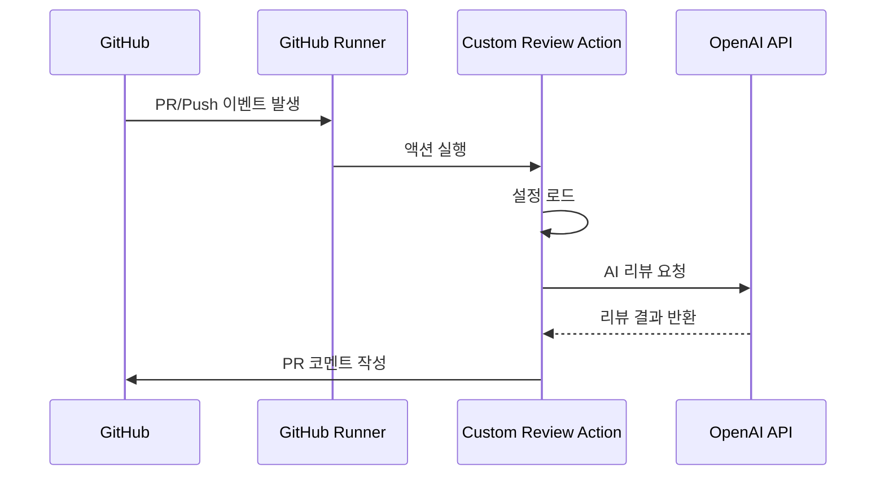
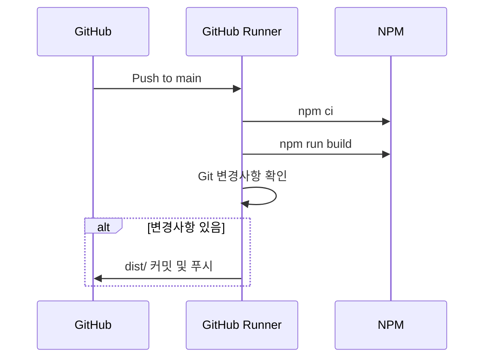
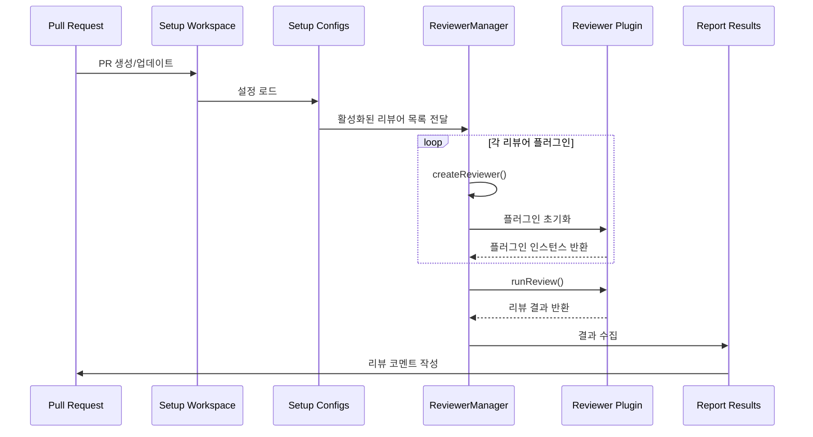
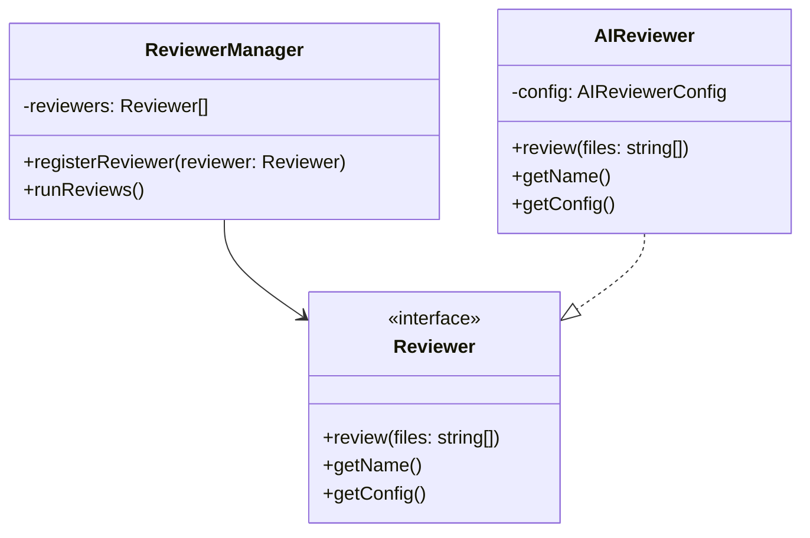

# GitHub Custom Reviewers 아키텍처

## 1. 기본 워크플로우
GitHub Custom Reviewers는 크게 세 가지 주요 워크플로우로 구성되어 있습니다:
- Test 워크플로우 (test.yml)
- Build 워크플로우 (build.yml)
- Review 프로세스 (src/)

## 2. 워크플로우 상세 설명

### 2.1 Test 워크플로우


### 2.2 Build 워크플로우


### 2.3 Review 프로세스

#### 2.3.1 플러그인 기반 리뷰 시스템


#### 2.3.2 플러그인 아키텍처


#### 2.3.3 리뷰어 플러그인 시스템 상세 설명

1. **플러그인 등록 프로세스**
   - `src/reviewers/index.ts`를 통한 플러그인 등록
   - 환경 변수 기반 동적 플러그인 활성화
   - 플러그인별 독립적인 설정 관리

2. **리뷰어 인터페이스**
   ```typescript
   interface Reviewer {
     review(files: string[]): Promise<ReviewResult>;
     getName(): string;
     getConfig(): ReviewerConfig;
   }
   ```

3. **플러그인 생명주기**
   - 초기화: 설정 로드 및 유효성 검증
   - 실행: 파일 분석 및 리뷰 수행
   - 종료: 리소스 정리 및 결과 반환

4. **확장 가능한 설계**
   - 새로운 리뷰어 추가가 용이한 구조
   - 플러그인별 독립적인 설정과 구현
   - 공통 인터페이스를 통한 일관성 유지

### 2.4 리뷰어 플러그인 종류

#### 2.4.1 AI 리뷰어
- OpenAI API 기반 코드 리뷰
- 다국어 리뷰 지원 (한국어, 영어, 일본어)
- 커스터마이즈 가능한 리뷰 정책

#### 2.4.2 향후 확장 가능한 플러그인
- 정적 분석 리뷰어
- 보안 취약점 리뷰어
- 성능 분석 리뷰어
- 커스텀 룰 기반 리뷰어

## 3. 주요 컴포넌트 설명

### 3.1 Setup Workspace (`setup-workspace.ts`)
- 작업 디렉토리 설정
- GitHub 컨텍스트 초기화
- 필요한 환경 변수 설정

### 3.2 Setup Configs (`setup-configs.ts`)
- 설정 파일 로드 및 파싱
- 기본값 설정
- 설정 유효성 검증

### 3.3 Run Reviews (`run-reviews.ts`)
- 파일 변경사항 분석
- AI 리뷰어 실행
- 리뷰 결과 수집

### 3.4 Report Results (`report-results.ts`)
- 리뷰 결과 포맷팅
- GitHub PR 코멘트 생성
- 에러 처리 및 보고

## 4. 설정 옵션

### 4.1 AI 리뷰어 설정
- `ai_reviewer_enabled`: AI 리뷰 활성화 여부
- `ai_reviewer_model`: 사용할 OpenAI 모델
- `ai_reviewer_temperature`: 응답 다양성 조절
- `ai_reviewer_max_tokens`: 최대 토큰 수
- `ai_reviewer_language`: 리뷰 언어 설정

### 4.2 GitHub 설정
- `github_token`: GitHub 인증 토큰
- `workdir`: 작업 디렉토리
- `fail_on_error`: 에러 발생 시 실패 여부
- `comment_mode`: 코멘트 모드 설정 